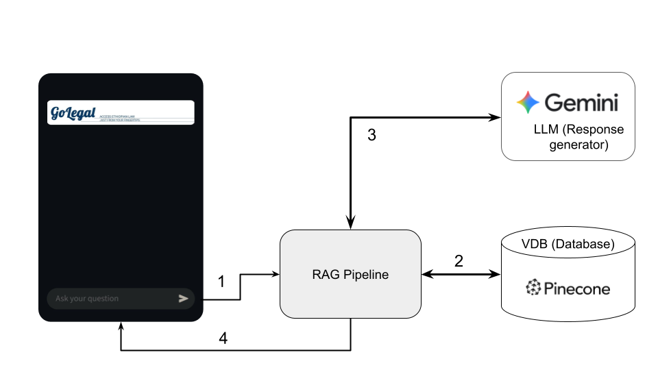

# LegalBot

An experimental legal question answering chatbot, for the Ethiopia jurisdiction (Disclaimer: This bot aint legal, at least for now):)

## Components: Frontend (Chat App) + RAG + VDB + LLM

1. *Ask question*: get question from the user (via the chat app user interface [UI]) 

2. *Get context* from the vector database (VDB)

3. *Combine context with question* and give to the large language model (LLM)

4. *Get response* and give it back to the chat app (the user)

## Next Steps
1. Test with some question (Correct issues related with article and chapter number questions)

2. Adding evaluation pipeline

3. AMHARIC feature

4. Adding other legal books (civil, criminal, family, ... and other Ethiopia Legislative Codes)